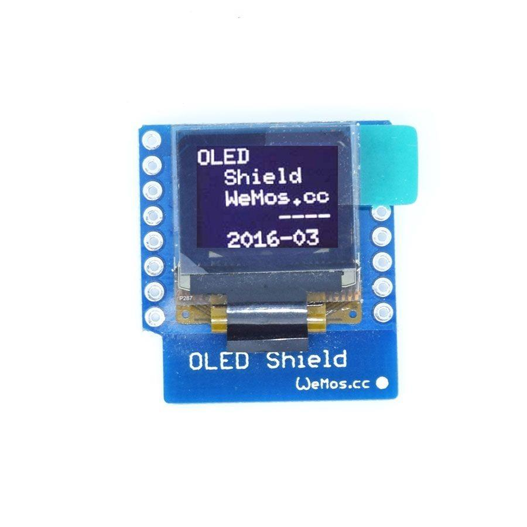

# Adafruit_SSD1306-esp8266-64x48
Modified library for WEMOS OLED shield 64x48.
64x48 is a size no more supported by the official library. This is an alternative libary to be used with the wemos oled shield or whatever oled I2C with 64 x x48 pixel resolution

